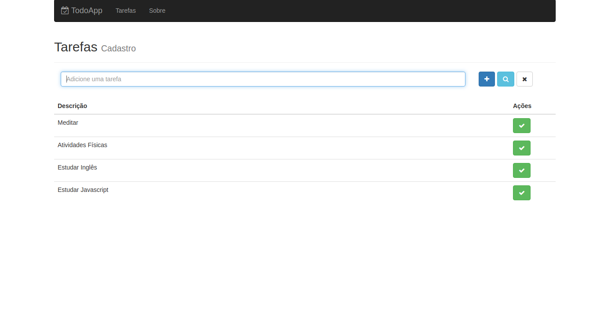
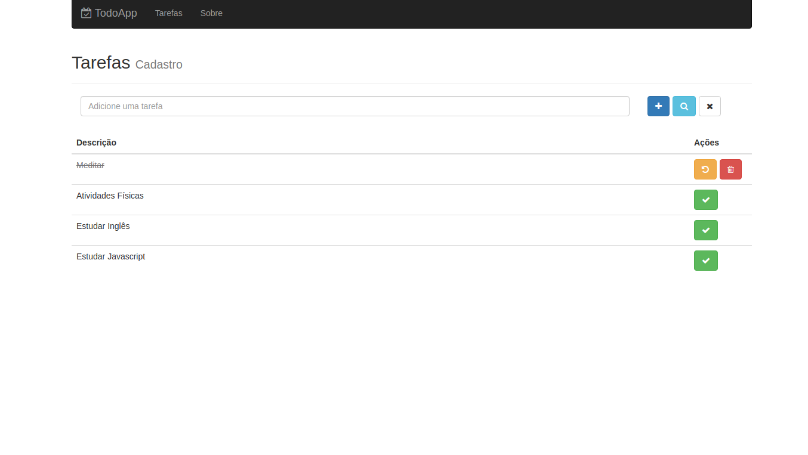

# Todo List 

Esse todo list é desenvolvido em React, o propósito desse projeto é fixar os conteúdos 
aprendidos em Redux, como também desenvolver um projeto utilizado o Bootstrap. Também há incluido
nesse projeto uma versão sem redux.

A imagem um, mostra a tela inicial do app, como também a lista de tarefas adicionadas.

 
 

A imagem dois mostra a conclusão de uma tarefa, também é possivel alterar ou excluir a tarefa.